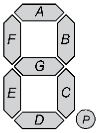

[](https://github.com/GyverLibs/GyverSegment/releases/latest/download/GyverSegment.zip)
[](https://alexgyver.ru/)
[](https://alexgyver.ru/support_alex/)
[](https://github-com.translate.goog/GyverLibs/GyverSegment?_x_tr_sl=ru&_x_tr_tl=en)  

[](https://t.me/GyverLibs)

# GyverSegment
Самая мощная библиотека для работы с дисплеями на 7-сегментных индикаторах
- Поддержка всех популярных китайских модулей (74HC595 4/8 цифр, TM1637 4/6 цифр + двоеточие, MAX7219 каскад любой длины)
- Символьный процессор и встроенный шрифт: удобный вывод на дисплей любых данных
- Единый API для всех дисплеев
- Бегущая строка, можно выводить несколько на одном дисплее
- 7 анимированных эффектов переключения символов
- Удобный API для поддержки всех возможностей на любом другом дисплее
- Настройка яркости для динамических дисплеев
- Быстрый bitbang на базе GyverIO - отправка данных на дисплей в 10 раз быстрее, чем в других библиотеках

### Совместимость
Совместима со всеми Arduino платформами (используются Arduino-функции)

### Зависимости
- [GyverIO](https://github.com/GyverLibs/GyverIO)

## Содержание
- [Документация](#docs)
  - [Дисплеи](#disp)
  - [Буфер](#buf)
  - [Бегущая строка](#run)
  - [Эффекты](#eff)
  - [Утилиты](#util)
  - [Добавить дисплей](#add)
- [Примеры](#examples)
- [Версии](#versions)
- [Установка](#install)
- [Баги и обратная связь](#feedback)

<a id="docs"></a>
<a id="disp"></a>
## Документация
### Поддерживаемые дисплеи
> Если вы нашли хороший модуль дисплея, который не поддерживается библиотекой - пишите. Закажу, протестирую, добавлю.

| Фото                                                | Контроллер | Размер | AliExpress                                                                                                                                    | Класс           |
|-----------------------------------------------------|------------|--------|-----------------------------------------------------------------------------------------------------------------------------------------------|-----------------|
|  | TM1637     | 0.36"  | [ссылка](https://fas.st/HEYSD?erid=LatgBbQo6), [ссылка](https://fas.st/kIITut?erid=LatgBbQo6), [ссылка](https://fas.st/PQw6B?erid=LatgBbQo6)  | `Disp1637Colon` |
|  | TM1637     | 0.56"  | [ссылка](https://fas.st/Y9x-Ei?erid=LatgBbQo6), [ссылка](https://fas.st/i9Wnt?erid=LatgBbQo6)                                                 | `Disp1637Colon` |
|        | TM1637     | 0.36"  | [ссылка](https://fas.st/6Ntg-?erid=LatgBbQo6), [ссылка](https://fas.st/zfmia?erid=LatgBbQo6), [ссылка](https://fas.st/s60Yu?erid=LatgBbQo6)   | `Disp1637_4`    |
|        | TM1637     | 0.56"  | [ссылка](https://fas.st/i9Wnt?erid=LatgBbQo6), [ссылка](https://fas.st/VBGW8?erid=LatgBbQo6)                                                  | `Disp1637_4`    |
|        | TM1637     | 0.36"  | [ссылка](https://fas.st/4uHOCd?erid=LatgBbQo6), [ссылка](https://fas.st/upp5P?erid=LatgBbQo6), [ссылка](https://fas.st/tT1PEx?erid=LatgBbQo6) | `Disp1637_6`    |
|        | TM1637     | 0.56"  | [ссылка](https://fas.st/i0dmi?erid=LatgBbQo6)                                                                                                 | `Disp1637_6`    |
|                    | 74HC595    | 0.36"  | [ссылка](https://fas.st/WC-EE?erid=LatgBbQo6), [ссылка](https://fas.st/5d6JH?erid=LatgBbQo6), [ссылка](https://fas.st/UT6RqC?erid=LatgBbQo6)  | `Disp595_4`     |
|                    | 74HC595    | 0.36"  | [ссылка](https://fas.st/SzV0w?erid=LatgBbQo6), [ссылка](https://fas.st/YM7Fu?erid=LatgBbQo6)                                                  | `Disp595_8`     |
|                | 74HC595    | 0.36"/0.56"  | [ссылка](https://fas.st/6x9q9R?erid=LatgBbQo6)                                                                                          | `Disp595_8v2`   |
|               | 74HC595    | 0.56"  | [ссылка](https://fas.st/wlOjS?erid=LatgBbQo6), [ссылка](https://fas.st/9eA7PC?erid=LatgBbQo6), [ссылка](https://fas.st/U6eEnq?erid=LatgBbQo6) | `Disp595Static` |
|                      | MAX7219    | 0.36"  | [ссылка](https://fas.st/_ugxv1?erid=LatgBbQo6), [ссылка](https://fas.st/IqQly3?erid=LatgBbQo6)                                                | `Disp7219`      |

### Как устроена библиотека
- Все дисплеи работают в режиме программного буфера - после внесения изменений в буфер нужно вызвать `update()`. Бегущая строка и эффекты переключения сами вызывают `update()`, когда им это нужно
- Все дисплеи наследуют класс `SegBuffer`, который отвечает за вывод данных, поэтому вывод одинаковый для всех дисплеев
- Инструменты `SegRunner` (бегущая строка) и `SegAnimation` (эффекты переключения) также работают одинаково для всех дисплеев
- У некоторых дисплеев есть дополнительные методы

### Общее
```cpp
void power(bool state);     // управление питанием (true вкл, false выкл)
void update();              // обновить дисплей
uint8_t* buffer;            // доступ к буферу
```

### TM1637
```cpp
Disp1637Colon(uint8_t DIO, uint8_t CLK);  // Модуль 4 цифры + двоеточие
Disp1637_4(uint8_t DIO, uint8_t CLK);     // Модуль 4 цифры + точки
Disp1637_6(uint8_t DIO, uint8_t CLK);     // Модуль 6 цифр + точки

// у всех
void brightness(uint8_t bright);          // яркость, 0.. 7

// у Disp1637Colon
void colon(bool show);                    // вкл-выкл двоеточие

// дефайны настроек (объявлять перед подключением библиотеки)
#define DISP1637_CLK_DELAY 100   // задержка интерфейса в мкс
```

### 74HC595
```cpp
Disp595_4(uint8_t DIO, uint8_t SCLK, uint8_t RCLK);     // Модуль 4 цифры
Disp595_8(uint8_t DIO, uint8_t SCLK, uint8_t RCLK);     // Модуль 8 цифр
Disp595_8v2(uint8_t DIO, uint8_t SCLK, uint8_t RCLK);   // Модуль 8 цифр, другая разводка
Disp595Static<int amount> (uint8_t SDI, uint8_t SCLK, uint8_t LOAD); // любое кол-во цифр. Статическая индикация!

// у всех
uint8_t tick();       // тикер динамической индикации, вызывать в loop
uint8_t tickManual(); // тикер динамической индикации, вызывать по своему таймеру
void brightness(uint8_t bright);    // установить яркость (0.. 15)

// дефайны настроек (объявлять перед подключением библиотеки)
#define DISP595_CLK_DELAY 0   // задержка интерфейса в мкс
#define GS_EXP_TIME 100       // время экспонирования знакоместа
```

> `Disp595Static` работает без вызова `tick`. Но если нужно управление яркостью - нужно вызывать `tick`!

### MAX7219
```cpp
// Модуль 8 цифр
Disp7219<int amount>(uint8_t DIN, uint8_t CLK, uint8_t CS, bool reverse = true);

void begin();                       // инициализировать (нужно после сброса питания модуля)
void brightness(uint8_t value);     // установить яркость (0.. 15)

// дефайны настроек (объявлять перед подключением библиотеки)
#define DISP7219_CLK_DELAY 0   // задержка интерфейса в мкс
```
- `amount` - количество *микросхем* MAX7219, каждая микросхема поддерживает 8 индикаторов, микросхемы можно соединять каскадом для увеличения длины бегущей строки
- `reverse` разворачивает выводимые данные справа налево для китайских модулей (умолч. вкл). Если собирать свой дисплей по даташиту - при объявлении нужно поставить `false`

### Голый дисплей
```cpp
DispBare<uint8_t digits, bool decimal = 1, bool anode = 0>(uint8_t* dig, uint8_t* seg);

uint8_t tick();       // тикер динамической индикации, вызывать в loop
uint8_t tickManual(); // тикер динамической индикации, вызывать по своему таймеру
void brightness(uint8_t bright);    // установить яркость (0.. 15)

// дефайны настроек (объявлять перед подключением библиотеки)
#define GS_EXP_TIME 100       // время экспонирования знакоместа
```
- `digits` - количество индикаторов
- `decimal` - индикатор с десятичными точками DP, которые подключены к пину
- `anode` - `true` - общий анод, `false` - общий катод
- `dig` - массив пинов индикаторов (совпадает по количеству с `digits`)
- `seg` - массив пинов сегментов (7 пинов без точки `decimal`, 8 с точкой)

### Скорость интерфейса
Почти у всех поддерживаемых дисплеев можно настроить скорость интерфейса через дефайн `DISPxxx_CLK_DELAY` - это задержка в микросекундах при передаче данных, стандартные значения указаны выше. Если дисплей не работает - попробуйте увеличить задержку на 50-100 мкс! Например некоторые китайские модули TM1637 стабильно работают при нулевой задержке, а некоторым нужно 100 мкс (стоит по умолчанию). Также при подключении дисплея длинными проводами и/или при наличии источников ЭМ помех придётся увеличить задержку, чтобы передача данных была более надёжной.

```cpp
#define DISP7219_CLK_DELAY 70
#include <GyverSegment.h>
```

### Динамические дисплеи
#### tick()
У динамических дисплеев (74HC595, DispBare) обязательно должен вызываться тикер `tick()`, т.к. он выводит поочерёдно все цифры *по своему таймеру*. Если в программе есть задержки, которые мешают вызывать тикер - на дисплее могут появиться артефакты (неравномерная яркость цифр, исчезание цифр и другие "глюки"). Если в программе есть глухие циклы - тикер нужно вызывать также внутри них:
```cpp
void loop() {
  disp.tick();

  while (1) {
    disp.tick();
    //.... break;
  }
}
```

В простом коде "на дилеях" можно использовать не встроенный `delay()`, а задержку дисплея. Библиотека будет вызывать тикер внутри него:
```cpp
disp.print("hello");
disp.update();
disp.delay(1000); // тикер сам вызывается здесь
disp.print("1234");
disp.update();
```

Как часто библиотека обновляет дисплей:
- При максимальной яркости - смена цифры каждую 1 миллисекунду
- При другой яркости - смена цифр каждые `GS_EXP_TIME` (умолч. 100) микросекунд + время ожидания, соответствующее яркости

#### tickManual()
Отрисовку дисплея можно делать самостоятельно по прерыванию таймера или другими способами, для этого есть тикер `tickManual()` - без встроенного таймера. Как часто его нужно вызывать:
- При установленной максимальной яркости (`15`) достаточно вызывать тикер каждые 2 миллисекунды. Этого достаточно для того, чтобы мерцания не было видно (проверено на 8-разрядном дисплее, на 4-разрядном можно увеличить время).
- Если нужно управление яркостью - тикер придётся вызывать чаще - каждые 100 микросекунд. На более длинных периодах появится мерцание на минимальной яркости.

<a id="buf"></a>

### SegBuffer - вывод на дисплей
Вывод на дисплей осуществляется так же, как у 99% других дисплеев и библиотек: нужно установить курсор в `setCursor(x)` и вывести нужные данные в `print(данные)`:
- Установить курсор можно в том числе "за дисплей" для создания своих анимаций и других сценариев
- `print()` - стандартный интерфейс [библиотеки Arduino](https://www.arduino.cc/reference/en/language/functions/communication/serial/print/), выводит любые данные (целые числа, с плавающей точкой, строки любого типа)
- Курсор автоматически смещается на длину текста
- Для обновления дисплея вызвать `update()`
- В библиотеку встроен довольно читаемый шрифт со всеми латинскими буквами и символами (32.. 126 ASCII). Строчные буквы равносильны большим
- Точки в тексте обрабатываются отдельно и выводятся в десятичный разделитель дисплея, если он есть
- Есть режим `printRight(true)`, в котором данные будут печататься справа налево от текущей позиции курсора. Курсор в этом случае не смещается во время печати, вместо этого весь дисплей смещается влево

  

```cpp
  DispXXX disp;   // любой дисплей из библиотеки
  // ...
  disp.setCursor(0);
  disp.print("hello");
  disp.update();

  // выравнивание по правому краю
  // числа неизвестной длины
  int val = 123;
  disp.setCursorEnd(sseg::intLen(val) - 1);
  disp.print(val);

  // или так
  disp.printRight(true);  // печатать справа
  disp.setCursorEnd();    // курсор в конец
  // disp.fillChar('0');  // с заполнением нулями
  disp.print(val);
  disp.printRight(false); // отключить печать справа
```

<details>
<summary>Описание класса</summary>

```cpp
// конструктор. decimal - поддерживает ли дисплей десятичные точки
SegBuffer(uint8_t* buffer, uint8_t size, bool decimal);

// установить курсор для печати, 0 (начало) слева
void setCursor(int16_t pos);

// установить курсор в начало
void home();

// установить курсор от конца дисплея (справа налево)
void setCursorEnd(int16_t pos = 0);

// получить позицию курсора
int16_t getCursor();

// проверка уместится ли int число при текущем курсоре
bool checkInt(int32_t val);

// проверка уместится ли float число при текущем курсоре
bool checkFloat(double val, uint8_t dec = 2);

// установить символ в позицию
void setChar(uint8_t pos, char symb);

// установить код в позицию
void set(uint8_t pos, uint8_t data);

// заполнить символом
void fillChar(char symb);

// заполнить кодом
void fill(uint8_t data);

// очистить
void clear();

// направление печати: false - печать слева, true - задвигание справа
void printRight(bool right);

// с указанием длины смещения буфера
void printRight(bool right, uint8_t shiftSize);

// установить или выключить десятичную точку на позиции
void point(uint8_t pos, bool state = 1);

// отобразить часы (час без нуля, минута с нулём) начиная с указанной позиции курсора
void showClock(uint8_t hour, uint8_t minute, uint8_t from = 0);

// вывести символ в текущую позицию курсора
size_t write(uint8_t data);

// получить размер дисплея
uint8_t getSize();

// аналог delay, но внутри него вызывается тикер динамической индикации
void delay(uint32_t prd);
```
</details>

<a id="run"></a>

### SegRunner - бегущая строка
Асинхронный вывод на дисплей бегущей строки в установленных границах курсора
- Так как вывод асинхронный, строка должна быть либо объявлена глобально, либо в области определения тикера на время работы бегущей строки.
- Во время движения строку можно изменять, это будет работать корректно. Но если у строки меняется длина - нужно вызвать `setText()` для её пересчёта. Движение не начнётся заново!
- После выхода за левый край дисплея строка движение автоматически запускается сначала. Отследить это можно по результату `tick()` (см. ниже)

```cpp
DispXXX disp;           // любой дисплей из библиотеки
SegRunner run(&disp);   // передать адрес дисплея

const char cstr_p[] PROGMEM = "progmem cstring";
const char* cstr[] = "cstring pointer";
char cstr_a[] = "global char array";
String str = "global String";

void setup() {
  // так можно
  run.setText_P(cstr_p);
  run.setText(cstr);
  run.setText(cstr_a);
  run.setText(str);
  // string literal изначально являются глобальными
  run.setText("hello");

  // так нельзя
  String lstr = "local String";
  run.setText(lstr);
  char lcstr_a[] = "local char array";
  run.setText(lcstr_a);

  run.start();  // запустить
  // run.setWindow(1, 6);  // границы, в которых движется текст
}

void loop() {
  // движение происходит здесь по таймеру
  run.tick();
}
```

Работать локально можно так:
```cpp
void foo() {
  SegRunner run(&disp);
  String str = "local string";
  run.setText(s);
  run.start();
  run.waitEnd();
  // это работает в том числе для динамических дисплеев
}
```

<details>
<summary>Описание класса</summary>

```cpp
// конструктор
SegRunner(SegBuffer* buf);

// установить текст const char*
void setText(const char* str);

// установить текст String
void setText(String& str);

// установить текст из PROGMEM (глобальный)
void setText_P(PGM_P str);

// установить окно вывода (x0, x1)
void setWindow(uint8_t x0, uint8_t x1);

// установить скорость (символов в секунду)
void setSpeed(uint16_t symPerSec);

// установить скорость (период в мс)
void setPeriod(uint16_t ms);

// запустить бегущую строку с начала
void start();

// остановить бегущую строку
void stop();

// продолжить движение с момента остановки
void resume();

// true - строка движется
bool running();

// ждать окончания движения строки
void waitEnd();

// тикер. Вернёт 0 в холостом, 1 при новом шаге, 2 при завершении движения
// Можно передать false чтобы дисплей не обновлялся сам
uint8_t tick(bool update = true);

// сдвинуть строку на 1 символ. Можно передать false чтобы дисплей не обновлялся сам
uint8_t tickManual(bool update = true);

// статусы возврата tick:
GS_RUNNER_IDLE
GS_RUNNER_STEP
GS_RUNNER_END
```
</details>

<a id="eff"></a>

### SegAnimation - эффекты переключения
Асинхронные анимации смены данных на дисплее
- Анимация создаёт свой буфер типа `SegBuffer`, в который нужно выводить новые данные *вместо вывода на дисплей*
- Система сама увидит изменение данных и воспроизведёт установленный эффект для смены изображения на актуальное
- Анимация воспроизводится только в заданных границах дисплея (начало, длина), остальной дисплей не затрагивает

Эффекты:
```cpp
SegEffect::Blink
SegEffect::RollUp
SegEffect::RollDown
SegEffect::TwistFill
SegEffect::TwistClear
SegEffect::SlideUp
SegEffect::SlideDown
```

```cpp
DispXXX disp;           // любой дисплей из библиотеки
// указать кол-во символов, дисплей и позицию курсора дисплея
SegAnimation<3> anim(&disp, 0);

void setup() {
  anim.setEffect(SegEffect::TwistClear);
  anim.start();

  // вывести новые данные и ждать окончания эффекта
  // ожидание корректно работает в т.ч. для динамических дисплеев
  anim.setCursor(0);
  anim.print(random(1000));
  anim.waitEnd();
  disp.delay(1000);

  anim.setCursor(0);
  anim.print(random(1000));
  anim.waitEnd();
  disp.delay(1000);
}

void loop() {
  anim.tick();
  disp.tick();

  static uint32_t tmr;
  if (millis() - tmr >= 1000) {
    // если где то изменить данные аниматора - 
    // он сам обновит дисплей
    anim.setCursor(0);
    anim.print(random(1000));
  }
}
```

<details>
<summary>Описание класса</summary>

```cpp
// конструктор
SegAnimation(SegBuffer* disp, uint8_t from, bool dec = 1);

// установить эффект и время его выполнения в мс
void setEffect(SegEffect eff, uint16_t duration = 300);

// запустить
void start();

// остановить анимацию
void stop();

// true - эффект воспроизводится
bool running();

// принудительно обновить дисплей из буфера эффекта
void refresh();

// воспроизводить эффект на всех цифрах (умолч. откл)
void forceAll(bool force);

// ждать окончания воспроизведения эффекта
void waitEnd();

// тикер. Вернёт 0 в холостом, 1 при новом шаге, 2 при завершении анимации
uint8_t tick();

// ручной тикер. Вернёт 0 в холостом, 1 при новом шаге, 2 при завершении анимации
uint8_t tickManual();

// статусы возврата tick:
GS_ANIMATION_IDLE
GS_ANIMATION_STEP
GS_ANIMATION_END
```
</details>

<a id="util"></a>

### Утилиты

```cpp
// получить код для символа
uint8_t sseg::getCharCode(char symb);

// получить длину int числа
uint8_t sseg::intLen(int32_t val);

// получить длину float числа при указанной точности
uint8_t sseg::floatLen(double val, uint8_t dec = 2);
```

<a id="add"></a>

### Как добавить дисплей
Библиотека позволяет очень легко добавлять свои возможности (вывод, бегущая строка, эффекты) к любым другим 7-сегментным дисплеям, даже самодельным. Для этого достаточно создать класс от `SegBuffer` и реализовать в нём:
- Буфер на нужное количество знакомест
- Метод `update()`, который будет выводить этот буфер на дисплей
- Метод `tick()` (для динамических дисплеев)
- Буфер имеет следующий порядок битов: `0bPGFEDCBA`



```cpp
// количество знакомест и наличие точек
// имена констант даны для примера
#define MY_DISP_SIZE 4
#define MY_DISP_DECIMALS true

class MyDisp : public SegBuffer {
   public:
    MyDisp() : SegBuffer(buffer, MY_DISP_SIZE, MY_DISP_DECIMALS) {}

    // обновить дисплей
    void update() {
        // ваш код
        return 0;
    }

    // тикер динамической индикации, вызывать в loop постоянно или по таймеру
    uint8_t tick() {
        // ваш код
        return 0;
    }

    uint8_t buffer[MY_DISP_SIZE] = {0};

   private:
};
```

Теперь ваш дисплей поддерживает все возможности библиотеки!

<a id="examples"></a>

## Примеры

```cpp
#include <Arduino.h>
#include <GyverSegment.h>

#define DIO_PIN 2
#define CLK_PIN 3
#define LAT_PIN 4

// объявление дисплеев. Выбери любой
Disp595_4 disp(DIO_PIN, CLK_PIN, LAT_PIN);
// Disp595_8 disp(DIO_PIN, CLK_PIN, LAT_PIN);
// Disp595_8v2 disp(DIO_PIN, CLK_PIN, LAT_PIN);
// Disp595Static<4> disp(DIO_PIN, CLK_PIN, LAT_PIN);
// Disp1637_4 disp(DIO_PIN, CLK_PIN);
// Disp1637_6 disp(DIO_PIN, CLK_PIN);
// Disp1637Colon disp(DIO_PIN, CLK_PIN);
// Disp7219<1> disp(DIO_PIN, CLK_PIN, LAT_PIN);  // 1 чип - 8 цифр

uint8_t digs[] = {2, 3, 4, 5, A2, A3, A4, A5};  // пины цифр
uint8_t segs[] = {6, 7, 8, 9, 10, 11, 12, 13};  // пины сегментов
// 8 цифр, дсятичные точки есть, общий катод
// BareDisp<8, true, false> disp(digs, segs);

void setup() {
  // используется disp.delay() для дисплеев с дин. индикацией

  // текст
  disp.setCursor(0);
  disp.print("hello");
  disp.update();
  disp.delay(1000);

  // целое число
  disp.setCursor(0);
  disp.print(1234);
  disp.update();
  disp.delay(1000);

  // float
  disp.setCursor(0);
  disp.print(3.14, 3);  // точность 3 знака
  disp.update();
  disp.delay(1000);

  // вывод числа справа с заполнением нулями
  disp.setCursorEnd();
  disp.printRight(true);
  disp.fillChar('0');
  disp.print(3.14, 3);
  disp.update();
  disp.delay(1000);

  disp.printRight(false);
}
void loop() {
  // нужен для дисплеев с динамической индикацией, но 
  // для совместимости есть у всех дисплеев, даже если ничего не делает
  disp.tick();
}
```

<a id="versions"></a>
## Версии
- v1.0
- v1.1 - добавлены forceAll() и длина для printRight()
- v1.1.1 - исправлен баг
- v1.1.2 - исправлен баг c printRight
- v1.2 
  - Переписан драйвер яркости для динамических дисплеев. Снижена нагрузка на процессор, повышена стабильность
  - Добавлен ручной тикер для динамических дисплеев
- v1.3 - добавлена поддержка дисплея Disp595_8v2
- v1.4 - добавлена поддержка дисплея Disp595Static

<a id="install"></a>
## Установка
- Библиотеку можно найти по названию **GyverSegment** и установить через менеджер библиотек в:
    - Arduino IDE
    - Arduino IDE v2
    - PlatformIO
- [Скачать библиотеку](https://github.com/GyverLibs/GyverSegment/archive/refs/heads/main.zip) .zip архивом для ручной установки:
    - Распаковать и положить в *C:\Program Files (x86)\Arduino\libraries* (Windows x64)
    - Распаковать и положить в *C:\Program Files\Arduino\libraries* (Windows x32)
    - Распаковать и положить в *Документы/Arduino/libraries/*
    - (Arduino IDE) автоматическая установка из .zip: *Скетч/Подключить библиотеку/Добавить .ZIP библиотеку…* и указать скачанный архив
- Читай более подробную инструкцию по установке библиотек [здесь](https://alexgyver.ru/arduino-first/#%D0%A3%D1%81%D1%82%D0%B0%D0%BD%D0%BE%D0%B2%D0%BA%D0%B0_%D0%B1%D0%B8%D0%B1%D0%BB%D0%B8%D0%BE%D1%82%D0%B5%D0%BA)
### Обновление
- Рекомендую всегда обновлять библиотеку: в новых версиях исправляются ошибки и баги, а также проводится оптимизация и добавляются новые фичи
- Через менеджер библиотек IDE: найти библиотеку как при установке и нажать "Обновить"
- Вручную: **удалить папку со старой версией**, а затем положить на её место новую. "Замену" делать нельзя: иногда в новых версиях удаляются файлы, которые останутся при замене и могут привести к ошибкам!

<a id="feedback"></a>
## Баги и обратная связь
При нахождении багов создавайте **Issue**, а лучше сразу пишите на почту [alex@alexgyver.ru](mailto:alex@alexgyver.ru)  
Библиотека открыта для доработки и ваших **Pull Request**'ов!

При сообщении о багах или некорректной работе библиотеки нужно обязательно указывать:
- Версия библиотеки
- Какой используется МК
- Версия SDK (для ESP)
- Версия Arduino IDE
- Корректно ли работают ли встроенные примеры, в которых используются функции и конструкции, приводящие к багу в вашем коде
- Какой код загружался, какая работа от него ожидалась и как он работает в реальности
- В идеале приложить минимальный код, в котором наблюдается баг. Не полотно из тысячи строк, а минимальный код